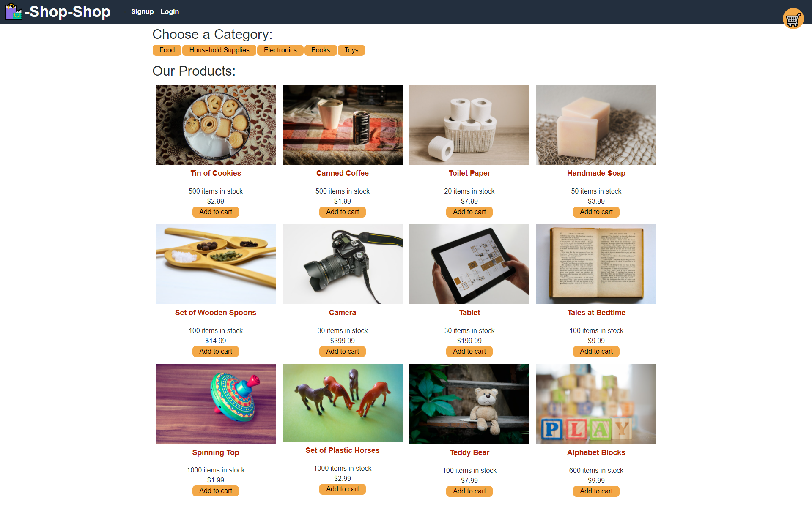

# eCommerce Redux Store

## Table of Contents

- [Description](#description)
- [Installation](#installation)
- [Usage](#usage)
- [License](#license)
- [Contributing](#contributing)
- [Tests](#tests)
- [Questions](#questions)

## Description

This project simulates a redux store for managing global state.

## Installation

Running "npm install" from the root directory will install the client and server side packages.

## Usage

This app allows you to browse items in an eCommerce-like front end, then create a cart and checkout.

## License

This project is covered under the Unliscensed license:

## Contributing

This project is not a real eCommerce platform, but improvement are welcome

## Tests

The front-end was tested after redux was implemented to verify functionaliy after replacing the Context API.

## Questions

Find me on GitHub: https://github.com/Concord511

Email me with questions: concord511@gmail.com
